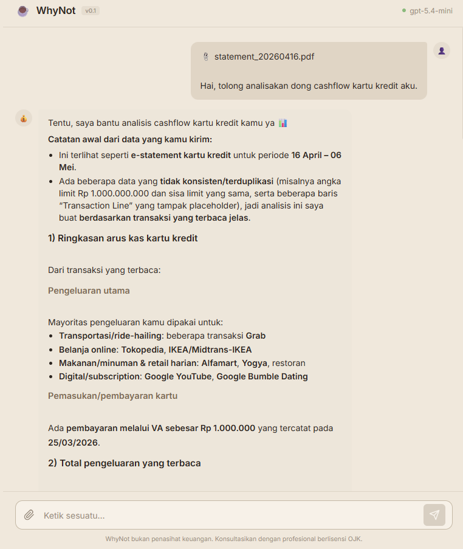
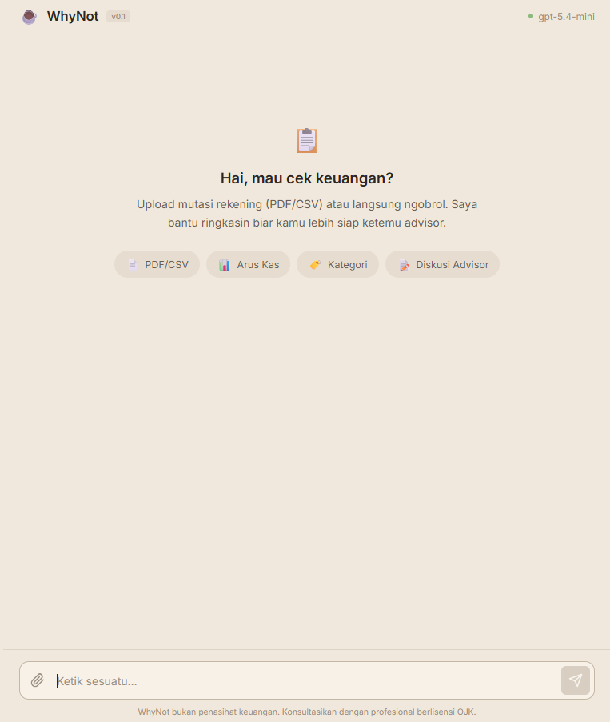

# ☕ WhyNot Chatbot

Whynot-chatbot adalah proyek chatbot keuangan yang dibuat untuk memenuhi proyek akhir dari **Maju Bareng AI for Developers batch 2 May** dari **Hacktiv8**. Whynot-chatbot dilengkapi dengan kemampuan membaca file PDF dan CSV dari bank untuk memahami keadaan finansial pengguna. Semua chat bersifat ephemeral atau sementara.

> ⚠️ **Disclaimer**: WhyNot bukan penasihat keuangan. Semua analisis bersifat informatif dan edukatif. Selalu konsultasikan dengan penasihat keuangan profesional yang terdaftar di OJK untuk keputusan keuangan penting.

## Fitur

- 📄 **Upload PDF/CSV** — Baca mutasi rekening atau laporan keuangan dari bank
- 📊 **Analisis Arus Kas** — Ringkasan pemasukan, pengeluaran, dan rasio tabungan
- 🏷️ **Kategorisasi Otomatis** — Pengelompokan transaksi (makanan, transportasi, belanja, dll)
- 📝 **Poin Diskusi Advisor** — Daftar topik yang bisa dibahas dengan penasihat keuangan profesional
- 🔌 **BYO API Key** — Gunakan provider LLM pilihanmu (OpenAI, Anthropic, OpenRouter, lokal, dll)
- 🔒 **Ephemeral Chat** — Tidak ada data yang disimpan setelah sesi berakhir

## Memulai

### Prasyarat

- [Node.js](https://nodejs.org/) v18 atau lebih baru
- API key dari provider LLM yang mendukung format OpenAI (OpenAI, OpenRouter, dll)

### Instalasi

```bash
# Clone repo
git https://github.com/muhdzakiy24/whynot-chatbot.git
cd whynot-chatbot

# Install dependencies
npm install

# Salin konfigurasi
cp .env.example .env
```

### Konfigurasi

Edit file `.env` sesuai kebutuhan:

```env
API_ENDPOINT=https://api.openai.com/v1
MODEL=gpt-4o
API_KEY=sk-your-api-key-here
# CUSTOM_PROMPT=Prompt kustom kamu di sini...
```

Lihat [`.env.example`](.env.example) untuk daftar lengkap opsi konfigurasi.

### Jalankan

```bash
npm start
```

Buka `http://localhost:3000` di browser.

## Cara Menggunakan

1. **Buka** `http://localhost:3000` di browser
2. **Upload** file mutasi rekening bank (PDF atau CSV) menggunakan tombol 📎 atau drag & drop
3. **Tanya** apa saja tentang data keuanganmu, atau minta analisis umum
4. WhyNot akan memberikan **ringkasan arus kas**, **kategorisasi pengeluaran**, dan **poin-poin diskusi** untuk dibawa ke advisor profesional

### Format File yang Didukung

| Format | Keterangan |
|--------|-----------|
| PDF | e-Statement digital (text-based). PDF hasil scan/foto belum didukung di v0.1 |
| CSV | File ekspor transaksi dari internet/mobile banking |

## Tech Stack

| Komponen | Teknologi |
|----------|-----------|
| Backend | Node.js, Express |
| Frontend | Vanilla HTML, CSS, JavaScript |
| PDF Parsing | pdf-parse |
| CSV Parsing | csv-parse |
| API | OpenAI-compatible endpoints (streaming via SSE) |

## Project Structure

```
whynot-chatbot/
├── server.js             # Express server (API proxy, file upload, SSE streaming)
├── lib/
│   ├── api.js            # OpenAI-compatible API client
│   ├── parser.js         # PDF & CSV text extraction
│   └── prompt.js         # System prompt + safety guardrails
├── public/
│   ├── index.html        # Chat UI
│   ├── styles.css        # Styling
│   └── app.js            # Frontend logic
├── .env.example          # Template konfigurasi
├── package.json
└── LICENSE
```

## Privasi

- **Ephemeral by design** — Semua percakapan hanya ada di memori selama sesi berlangsung. Tidak ada database, tidak ada penyimpanan chat.
- **File langsung dihapus** — File yang diupload diproses lalu langsung dihapus dari server setelah teksnya diekstrak.
- **API key di server** — API key disimpan di `.env` dan tidak pernah dikirim ke browser.
- **Localhost only** — Dirancang untuk berjalan di mesin lokal pengguna.

## Contributing

Kontribusi sangat diterima! Silakan buat issue atau pull request.

1. Fork repo ini
2. Buat branch fitur (`git checkout -b feature/fitur-baru`)
3. Commit perubahan (`git commit -m 'Feat: nama fitur'`)
4. Push ke branch (`git push origin feature/fitur-baru`)
5. Buat Pull Request

## License

Proyek ini dilisensikan di bawah [MIT License](LICENSE).
